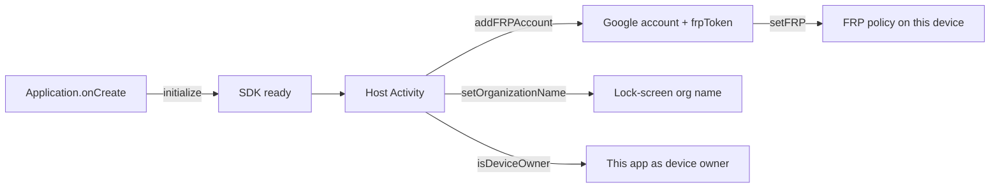

<p align="center">
  
</p>

<p align="center">
  <strong>PROVISIONER JATT FRP SDK</strong><br/>
  <em>Factory reset protection and lock-screen organization name. Your screens. Our FRP.</em>
</p>

<p align="center">
  
  
  
  
  
</p>

<p align="center">
  Sign in a Google account. Apply factory reset protection.<br/>
  Set the lock-screen organization name. The host app keeps every Activity.
</p>

---

## What this SDK already does

You do **not** build these in the host app.

| Built in | You never write |
| --- | --- |
| Device-owner check (`isDeviceOwner`) | Host `DevicePolicyManager` device-owner query |
| FRP Google account chooser (`addFRPAccount`) | Host Google sign-in Activity |
| Apply factory reset protection (`setFRP`) | Host `FactoryResetProtectionPolicy` |
| Lock-screen organization name (`setOrganizationName`) | Host `setOrganizationName` / lock-screen footer |

This library is **FRP only**. USB ADB, wireless pairing, QR, DPC automation, and device lists live in the [full Provisioner Jatt SDK](https://github.com/jatinsinghsatija/Provisioner-Jatt-SDK).

Implementation path after JitPack: **depend → `initialize` → call FRP APIs**.



Every snippet is **Kotlin**, then **Java**. The sliding tab matches the block under it.

## Changelog

### v1.2.2

Same version as the full Provisioner Jatt SDK.

Use `implementation("com.github.jatinsinghsatija:Provisioner-Jatt-FRP-SDK:v1.2.2")`.

### v1.2.1

Same version as the full Provisioner Jatt SDK.

- **`initialize`.** Starts the SDK and records the host **package name** for access the same way as the full SDK. Does not open UI by itself. Does not take a Google client ID.
- **FRP.** `ProvisionerJattFrp.addFRPAccount` runs Google’s current account chooser (Credential Manager) on the **calling host activity** (no SDK activity). Pass the OAuth **web client ID** as `serverClientId` on that call — not on `initialize`. After success the SDK returns `name`, `email`, and `frpToken`. `setFRP(token)` requires this app to be device owner and applies factory reset protection. Optional `ProvisionerJattFrp.setOrganizationName(orgName)` is a separate call on **that class only** (not on `ProvisionerJatt`): it internally checks that this host app is device owner, then writes the lock-screen organization name. Failures include a specific `reason`.
- **`isDeviceOwner()`.** Checks whether the integrating app is device owner of **this** device.

Use `implementation("com.github.jatinsinghsatija:Provisioner-Jatt-FRP-SDK:v1.2.1")`.

---

# Implementation

This section is what you must wire.

## SDK implementation

Open the **root** Gradle settings file. Add Google, Maven Central, and JitPack. JitPack serves this SDK (AAR + POM). The POM pulls the rest.

<p>
  
</p>

<p><sub>SETTINGS · SETTINGS.GRADLE.KTS</sub></p>

```kotlin
dependencyResolutionManagement {
    repositoriesMode.set(RepositoriesMode.FAIL_ON_PROJECT_REPOS)
    repositories {
        google()
        mavenCentral()
        maven("https://jitpack.io")
    }
}
```

<p>
  
</p>

<p><sub>SETTINGS · SETTINGS.GRADLE</sub></p>

```groovy
dependencyResolutionManagement {
    repositoriesMode.set(RepositoriesMode.FAIL_ON_PROJECT_REPOS)
    repositories {
        google()
        mavenCentral()
        maven { url 'https://jitpack.io' }
    }
}
```

In the **app** module, set `minSdk` 26. The SDK’s minimum supported Gradle is **8.13**. Add a single `implementation`. Do not drop a raw AAR into `app/libs/`. Do not re-declare the SDK’s transitive libraries.

<p>
  
</p>

<p><sub>APP · BUILD.GRADLE.KTS</sub></p>

```kotlin
android {
    defaultConfig {
        minSdk = 26 // Gradle 8.13+
    }
}

dependencies {
    implementation("com.github.jatinsinghsatija:Provisioner-Jatt-FRP-SDK:v1.2.2")
}
```

<p>
  
</p>

<p><sub>APP · BUILD.GRADLE</sub></p>

```groovy
android {
    defaultConfig {
        minSdk 26 // Gradle 8.13+
    }
}

dependencies {
    implementation 'com.github.jatinsinghsatija:Provisioner-Jatt-FRP-SDK:v1.2.2'
}
```

`INTERNET` and network-state permissions **merge from the AAR**.

The sample app is **DummyFRP** (`:dummyfrp`, applicationId `com.beastblocks.provisionerjattsdkfrp`).

---

## Initialize in `Application`

`initialize` starts the SDK and records the host package name for access. It does **not** open the Google chooser or write device-owner policy until you call `addFRPAccount`, `setFRP`, or `setOrganizationName`. Pass the Google OAuth **web** client ID to `addFRPAccount`, not here.

Register the `Application` class in the manifest. `ProvisionerJatt.initialize(this)` is the full initialize call.

<p>
  
</p>

<p><sub>APPLICATION · APP.KT</sub></p>

```kotlin
import android.app.Application
import com.beastblocks.provisionerjattsdkfrp.ProvisionerJatt

class App : Application() {
    override fun onCreate() {
        super.onCreate()
        ProvisionerJatt.initialize(this)
    }
}
```

```xml
<application
    android:name=".App"
    ... >
```

<p>
  
</p>

<p><sub>APPLICATION · APP.JAVA</sub></p>

```java
import android.app.Application;
import com.beastblocks.provisionerjattsdkfrp.ProvisionerJatt;

public class App extends Application {
    @Override
    public void onCreate() {
        super.onCreate();
        ProvisionerJatt.initialize(this);
    }
}
```

```xml
<application
    android:name=".App"
    ... >
```

---

## Exposed functions

`ProvisionerJatt.get()` (or the value returned by `initialize`) is the client. FRP calls hang off `ProvisionerJattFrp`. Comments in the snippets are the contract.

<p>
  
</p>

<p><sub>CLIENT · KOTLIN</sub></p>

```kotlin
val client = ProvisionerJatt.get()

// If *this* app is device owner of this device.
ProvisionerJatt.isDeviceOwner()
client.isDeviceOwner()

ProvisionerJattFrp.addFRPAccount(this, { result -> /* name, email, frpToken or reason */ }, getString(R.string.default_web_client_id))
ProvisionerJattFrp.setFRP(frpToken)
ProvisionerJattFrp.setOrganizationName("Acme")
```

<p>
  
</p>

<p><sub>CLIENT · JAVA</sub></p>

```java
ProvisionerClient client = ProvisionerJatt.get();
boolean deviceOwner = client.isDeviceOwner();
boolean also = ProvisionerJatt.isDeviceOwner(this);

ProvisionerJattFrp.addFRPAccount(this, result -> { /* name, email, frpToken or reason */ }, getString(R.string.default_web_client_id));
FrpSetResult frpApplied = ProvisionerJattFrp.setFRP(frpToken);
FrpSetResult orgApplied = ProvisionerJattFrp.setOrganizationName("Acme");
```

### `isDeviceOwner` — this app as device owner

**Use when:** you need to know whether the app this SDK is integrated into is the **device owner of that same device**. This is **this device**, not a phone you provision over ADB.

**How:** `ProvisionerJatt.isDeviceOwner()` (or `client.isDeviceOwner()`). Pass a `Context` when `initialize` has not run yet.

| Result | When |
| --- | --- |
| Returns `true` | This app is device owner of this device |
| Returns `false` | This app is not device owner, `initialize` has not run and no `Context` was passed, or the SDK is not licensed |

### `addFRPAccount` / `setFRP` / `setOrganizationName` — factory reset protection

**Use when:** you need a Google-account FRP token from the integrating app, then later apply that token on a **device-owner** app. Optionally set the lock-screen organization name on that same device-owner app.

**How:** `addFRPAccount(activity, callback, serverClientId)` runs Google’s current account chooser **on that same host activity**. There is no extra SDK activity. The chooser is Credential Manager (`GetGoogleIdOption`), which shows the host app identity from that OAuth client. The **web client ID** is required on this call (`serverClientId`). Do not pass it to `initialize`. See **Get a Web client ID**. On success the SDK returns `name`, `email`, and `frpToken`, then clears the Credential Manager sign-in state. `setFRP(token)` runs on this device: if the app is not device owner it fails; otherwise it applies factory reset protection from that token. Optional `setOrganizationName(orgName)` is a **separate** call (it is not part of add/set FRP). It internally checks that **this host app** is device owner of this device, then writes the lock-screen organization name. Blank `orgName` clears it. Pass a `Context` when `initialize` has not run.

**What happens:** only `addFRPAccount`, `setFRP`, and `setOrganizationName` are public on `ProvisionerJattFrp`. Failures return `success = false` with a specific `reason` (cancelled sign-in, Play services missing, not device owner, invalid token, and so on).

<p>
  
</p>

<p><sub>CLIENT · FRP</sub></p>

```kotlin
ProvisionerJattFrp.addFRPAccount(this, { result ->
    if (result.success) {
        val name = result.name
        val email = result.email
        val frpToken = result.frpToken
    } else {
        val reason = result.reason
    }
}, getString(R.string.default_web_client_id))
val applied = ProvisionerJattFrp.setFRP(frpToken)
val org = ProvisionerJattFrp.setOrganizationName("Acme")
```

<p>
  
</p>

<p><sub>CLIENT · FRP</sub></p>

```java
ProvisionerJattFrp.addFRPAccount(this, result -> {
    if (result.getSuccess()) {
        String name = result.getName();
        String email = result.getEmail();
        String frpToken = result.getFrpToken();
    } else {
        String reason = result.getReason();
    }
}, getString(R.string.default_web_client_id));
FrpSetResult applied = ProvisionerJattFrp.setFRP(frpToken);
FrpSetResult org = ProvisionerJattFrp.setOrganizationName("Acme");
```

| Result | When |
| --- | --- |
| `addFRPAccount` `success` | Google account chooser returned an account and `frpToken` is ready, then Credential Manager state was cleared |
| `addFRPAccount` failure | Missing host web client ID, Play services missing, sign-in cancelled or failed, or a sign-in is already running |
| `setFRP` `success` | This app is device owner and factory reset protection was applied from `token` |
| `setFRP` failure | Not device owner, empty or invalid token, no admin, or the system rejected the FRP policy |
| `setOrganizationName` `success` | This host app is device owner and `orgName` was written to the lock screen |
| `setOrganizationName` failure | Not device owner, no admin, `initialize` has not run and no `Context` was passed, or the system rejected the change |

---

# Features

## Factory reset protection

`addFRPAccount` is the Google sign-in step. Call it from a `ComponentActivity` (`AppCompatActivity` or `androidx.activity.ComponentActivity`). The SDK does not start its own Activity.

`setFRP` is a later step on a **device-owner** host. Pass the `frpToken` from a successful `addFRPAccount`. DummyFRP stores that token and applies it from **Set FRP**.

## Organization name

`setOrganizationName` is optional and independent of add/set FRP. Call it only when this host app is device owner of **this** device and you want the lock-screen managed-device footer. Blank `orgName` clears it.

## DummyFRP

`:dummyfrp` is the sample. It depends only on this SDK. Buttons: **Set account FRP**, **Set FRP**, **Set organization name**. Pass a Google **web** client ID to `addFRPAccount` (DummyFRP reads `default_web_client_id` and passes that string into the call).

---

## Host checklist

- [ ] `minSdk` 26+ · Gradle 8.13+
- [ ] JitPack `implementation("com.github.jatinsinghsatija:Provisioner-Jatt-FRP-SDK:v1.2.2")` — one line, POM included
- [ ] `google()`, `mavenCentral()`, `jitpack.io`
- [ ] `Application` registered, `initialize` in `onCreate`
- [ ] Google OAuth **web** client ID: pass `serverClientId` to `addFRPAccount` (not to `initialize`). See **Get a Web client ID**
- [ ] `addFRPAccount` from a host `ComponentActivity`
- [ ] `setFRP(token)` / `setOrganizationName(orgName)` only when this app is device owner of this device
- [ ] Play services available on the device for the Google account chooser

The SDK does not bypass Android enterprise policy. `setFRP` and `setOrganizationName` still require this app to be device owner of **this** device.

---

# Full SDK

Need USB + wireless ADB provisioning, QR / pair-code overlays, DPC automation, and the device list as well? Use the full SDK:

**[Provisioner Jatt SDK](https://github.com/jatinsinghsatija/Provisioner-Jatt-SDK)**

---

# Get a Web client ID

`addFRPAccount` needs a Google OAuth **Web** client ID as `serverClientId`. That is not an Android client ID, and it is not passed to `initialize`. Create it in Firebase:

1. Open the [Firebase Console](https://console.firebase.google.com/) and sign in.
2. Create a Firebase project, or open the project that will serve this host app.
3. Open **Project settings** (gear) → **Your apps**. Add an **Android** app if one is not listed. The Android package name must match the host `applicationId`. Add the app’s **SHA-1** and **SHA-256** from the debug and release signing certificates so Google Sign-In can run on a device.
4. Open **Authentication** → **Sign-in method**. Enable **Google** and save.
5. On the Google provider page, copy the **Web client ID**. It ends with `.apps.googleusercontent.com`. You can also find it under **Project settings** → **General**.
6. Pass that string as the last argument of `ProvisionerJattFrp.addFRPAccount`. Hosts often keep it in a string resource and pass `getString(R.string.default_web_client_id)`.

Do not use the **Android** OAuth client ID for `serverClientId`.

---

<p align="center">
  
  <br/>
  <sub>Provisioner Jatt FRP SDK · v1.2.2 · <code>com.beastblocks.provisionerjattsdkfrp</code></sub>
</p>
